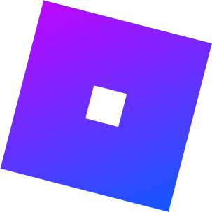

<p align="center"></p><h1 align="center">Ro32</h1>
<div align="center">
  
[](https://github.com/gingerphoenix10/Ro32/releases)
[](https://github.com/gingerphoenix10/Ro32/releases)
[](https://github.com/gingerphoenix10/Ro32/blob/main/LICENSE)
[](https://discord.gg/TZ8qW4HRsG)
[](https://github.com/gingerphoenix10/Ro32/actions)

</div>
Ro32 is an open-source project built for the Roblox client, Aiming to add more features for devs to interact with the user's device in ways such as opening new windows, moving around Roblox's window itself, and more features available and being worked on.
<br><br>
A lot of the code is used and modified from

[Bloxstrap](https://github.com/pizzaboxer/Bloxstrap) by
[Pizzaboxer](https://github.com/pizzaboxer), and therefore is also coded in the C# Programming language.
This is the first time i've used C# for anything other than Unity, so the code isn't very good, and it could most likely be improved in hundreds of different ways. If you want to help the development of Ro32 however, You can submit a pull request, and it'll be decided if it will be added (probably)

# Installation & Usage
## Software
To install the Ro32 software, Download the latest version from the [Releases](https://github.com/gingerphoenix10/Ro32/Releases/Latest) tab, and unzip the file. Once unzipped, run Ro32.exe and start Roblox. (Roblox must be opened after running Ro32). The text on the Ro32 application should change to say "Opened", and from there, joining a Ro32 supported game should have their events fired automatically.
## Roblox Studio API
Get the [Ro32 API model](https://create.roblox.com/store/asset/16844513511/Ro32-API) from the Roblox Studio toolbox, and import the ModuleScript into your game. It can be located anywhere, but it's recommended to put the script inside ReplicatedStorage.  (Ro32 can be run alongside Roblox Studio, not just Roblox Player).
Now inside a LocalScript, initialize the module by running `local Ro32 = require(game.ReplicatedStorage.Ro32)`. Change game.ReplicatedStorage to wherever you placed your ModuleScript.
Now from anywhere else in the script, you can run these functions:

### `Ro32.DialogBox(Title: string, Text: string)`
This will open up a windows dialog box with the inputted title and text.<br><br>
Example:
```Lua
local Ro32 = require(game.ReplicatedStorage.Ro32)
local title = "Window Title"
local text = "Window Text!"
Ro32.DialogBox(title, text)
```

### `Ro32.Window.Minimize()`
Minimizes the Roblox window.<br><br>
Example:
```Lua
local Ro32 = require(game.ReplicatedStorage.Ro32)
Ro32.Window.Minimize()
```
Nothing else to it.
### `Ro32.Window.Maximize()`
Simmilarly to Ro32.Window.Minimize, Ro32.Window.Maximize will maximize the Roblox window if minimized or floating.<br><br>
Example:
```Lua
local Ro32 = require(game.ReplicatedStorage.Ro32)
Ro32.Window.Maximize()
```
### `Ro32.Window.Float(X: int, Y: int, Width: int, Height: int)`
Puts the Roblox window into a floating window at the given coordinates and size in pixels.<br>
The X and Y coordinates are the coordinates at the top left of the window.<br><br>
Example:
```Lua
local Ro32 = require(game.ReplicatedStorage.Ro32)
local XCoord = 600
local YCoord = 300
local Width = 960
local Height = 540
Ro32.Window.Float(XCoord, YCoord, Width, Height)
```
### `Ro32.Window.Title.Set(Title: string)`
Sets the title of the Roblox window to the inputted string.<br><br>
Example:
```Lua
local Title = "Roblox Window Title"
Ro32.Window.Title.Set(Title)
```
### `Ro32.Window.Title.Reset()`
Resets the Roblox window's title back to default. For now just sets to "Roblox", so Roblox Studio's window will change to the Roblox Player title, not the current studio title.<br><br>
Example:
```Lua
local Ro32 = require(game.ReplicatedStorage.Ro32)
Ro32.Window.Title.Reset()
```
### `Ro32.Wallpaper.Set(URL: string, FitType: string)`
<div align="center" style="color:red">
--CURRENTLY DOESN'T SEEM TO BE WORKING--
</div>
Will change the user's Background wallpaper to the inputted image from a URL.<br><br> FitType can be set to:<br>`Center` - Centers the image on the user's desktop, and keeps aspect ratio<br>`Fit` - Will rename in an update. Tiles the image for all displays.<br>`Stretch` (or any value other than Center or Fit) - Stretches the image to fit the user's desktop.<br><br>
(Also closes Wallpaper Engine if running.)<br><br>
Example:

```Lua
local Ro32 = require(game.ReplicatedStorage.Ro32)
local ImageURL = "https://raw.githubusercontent.com/gingerphoenix10/Ro32/main/logo.png"
local FitType = "Stretch"
Ro32.Wallpaper.Set(ImageURL, FitType)
```

### `Ro32.Wallpaper.Reset()`
Reset's the user's wallpaper to the image it was set to before running Ro32.Wallpaper.Set. Reboots Wallpaper Engine if it was running before Ro32.Wallpaper.Set.<br><br>
Example:
```Lua
local Ro32 = require(game.ReplicatedStorage.Ro32)
Ro32.Wallpaper.Reset()
```
### `Ro32.Filesystem.Create(Path: string, Contents: string)`
Writes the text in Contents to a file given by FilePath.<br>
<div align="center" style="color:red">
-- WARNING --<br>
This function is pretty dangerous, so I am probably going to add some security to this function.
</div>
<br><br>
Example:

```Lua
local Ro32 = require(game.ReplicatedStorage.Ro32)
local FilePath = "C:\\ExamplePath\\ExampleFile.txt"
local Content = "This is the text to be stored in the file!"
Ro32.Filesystem.Create(FilePath, Content)
```

# Building
You will require [Visual Studio](https://visualstudio.microsoft.com/downloads/), and the .NET desktop development workload (download with Visual Studio installer). I don't think there are any other requirements, but don't take my word for it.
Once Visual Studio is installed, Clone the repository, either via Git with "git clone https://github.com/gingerphoenix10/Ro32.git", or by clicking the Download Zip button at the top of the repository, and extracting that.
Now start Visual Studio, and open the "Ro32.sln" file in the git repository you downloaded. Most of the code so far is stored in `Ro32.cs`.<br>
When you're ready, press the green start button labeled "Ro32" to build and run the application.
Built .exe files will be stored in `(project)\bin\Debug\net8.0-windows\Ro32.exe`
